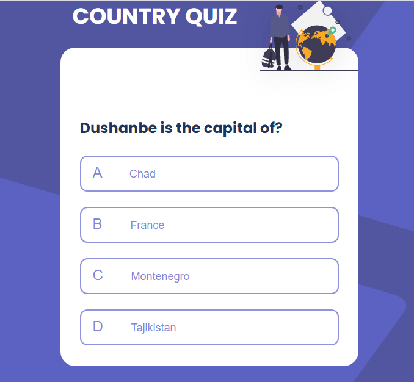
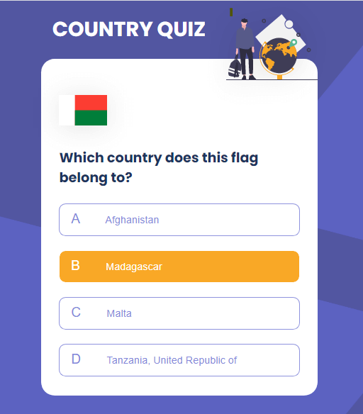
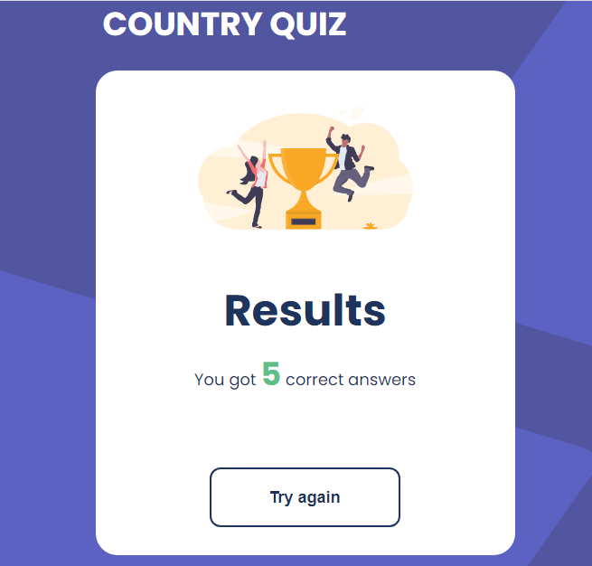
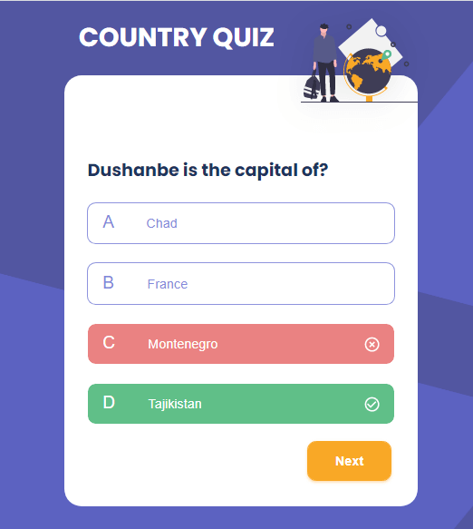
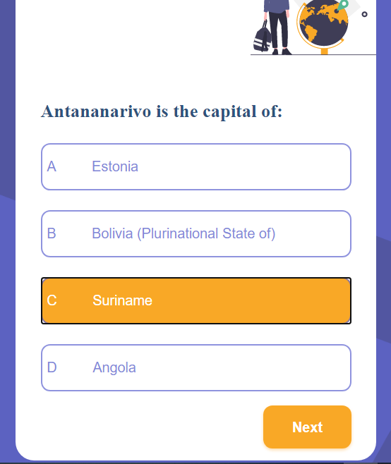
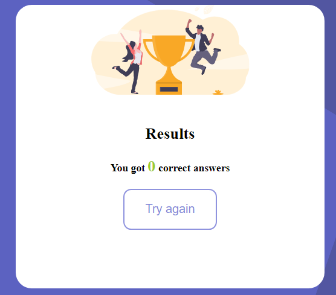

# Country Quiz

Challenge: Create a country quiz app using an API, and use React to handle the frontend. Don’t look at the existing solution. Fulfill user stories below:






-   User story: I can see at least 2 types of question: a city is the capital of.. or a flag belong to country..
-   User story: I can see select an answer
-   User story: I can see if my answer is correct or incorrect
-   User story: When I answer correctly, I can move on to the next question
-   User story: When I answer incorrectly, I can see my results and try again
-   User story: I can try again

**Icon**: https://google.github.io/material-design-icons/

**API**: https://restcountries.eu/. Use data from the API to create questions and answers.

**Design** : https://www.figma.com/file/Gw0ZNBbYN8asqFlZWy3jG1

**Live app** : https://country-quiz-app.netlify.app/

As long as you fulfill all the user stories, you can give your personal touches by adding transition, using your own images, changing colors, or even creating your own layout,...

Once you completed, submit your solutions by providing URLs for both GitHub repository and live app on Netlify and explain briefly what you have done.

For the custom domain url you'll enter in netlify, please use the following naming convention : **country-quiz-_YOUR_FIRSTNAME_.netlify.app** (replace YOUR_FIRSTNAME by your firstname)

Good luck everybody!

Template for your readme :

<!-- Please update value in the {}  -->

<h1 align="center">Country quiz</h1>

<div align="center">
  <h3>
    <a href="https://{your-demo-link.your-domain}">
      Demo
    </a>
    <span> | </span>
    <a href="https://{your-url-to-the-solution}">
      Solution
    </a>
  </h3>
</div>

<!-- TABLE OF CONTENTS -->

## Table of Contents

-   [Overview](#overview)
    -   [Built With](#built-with)
-   [Features](#features)
-   [How to use](#how-to-use)
-   [Contact](#contact)
-   [Acknowledgements](#acknowledgements)

<!-- OVERVIEW -->

## Overview





<!-- Introduce your projects by taking a screenshot or a gif. Try to tell visitors a story about your project by answering:

-   Where can I see your demo?
-   What was your experience?
-   What have you learned/improved?
-   Your wisdom? :) -->

### Structure of the project.

#### I had two components : 
- AboutCountry  
- Result

#### In the *AboutCountry* component: 
- Imported urls from API
- Created function which contains: states, random functions and an array that handle two questions. I use *useEffect()* for passing all of the functions that I have created before.
- I aslo tried to use *Math.random()* to random the data that I get from the API.
- Finally, mapping over arrays inside the return.

### If I had more time,

I would like continuing to search a way to get the random working in the page but not only in console.log() before I will move on. Because, I can't countue get I did't get even the random country name or capital work.

### Did you learn anything new while working on this project?

I did't learn so much as I got stuck from the begining. 

### The most challenging parts
Most of the parts are challenging for me. What I mean is that I always have difficulties about the logic, on what I should use. For example, I can get an array or objects when I console but I can't get it with states.
Yet, I still need more practice.

### I would like to have more explanation about: 
- Displaying functions in states. I always got (undefined);
- Sometimes, we map when we want to get data from API but in some cases we don't need to map. It is still a bit blurry.
- Using data from API.

### Built With

<!-- This section should list any major frameworks that you built your project using. Here are a few examples.-->

-   [React](https://reactjs.org/)
-   [css](https://developer.mozilla.org/en-US/docs/Web/CSS)

## Features

<!-- List the features of your application or follow the template. Don't share the figma file here :) -->

## How To Use

<!-- Example: -->

To clone and run this application, you'll need [Git](https://git-scm.com) and [Node.js](https://nodejs.org/en/download/) (which comes with [npm](http://npmjs.com)) installed on your computer. From your command line:

```bash
# Clone this repository
$ git clone https://github.com/your-user-name/your-project-name

# Install dependencies
$ npm install

# Run the app
$ npm start
```

## Acknowledgements


## Contact

-   Website [your-website.com](https://country-quiz-natacha.netlify.app/)
-   GitHub [@your-username](https://github.com/tsipoy/country-quiz)
-   Twitter [@your-twitter](https://{twitter.com/your-username})


