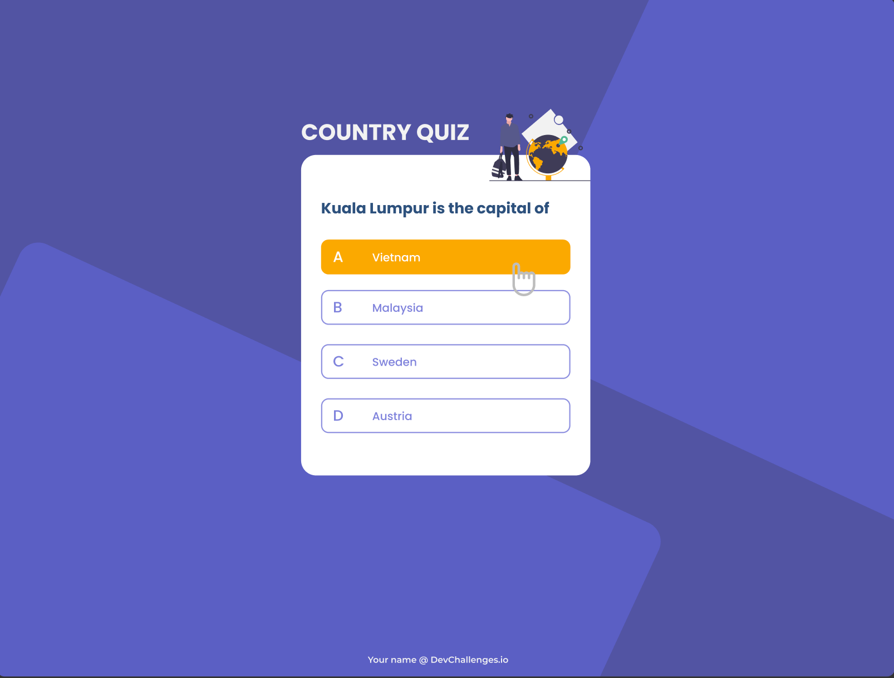
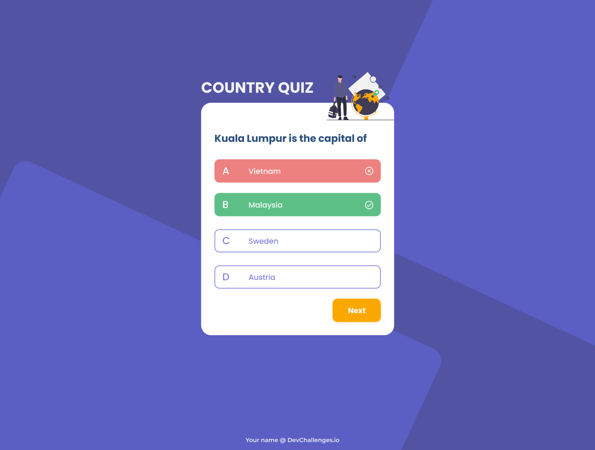
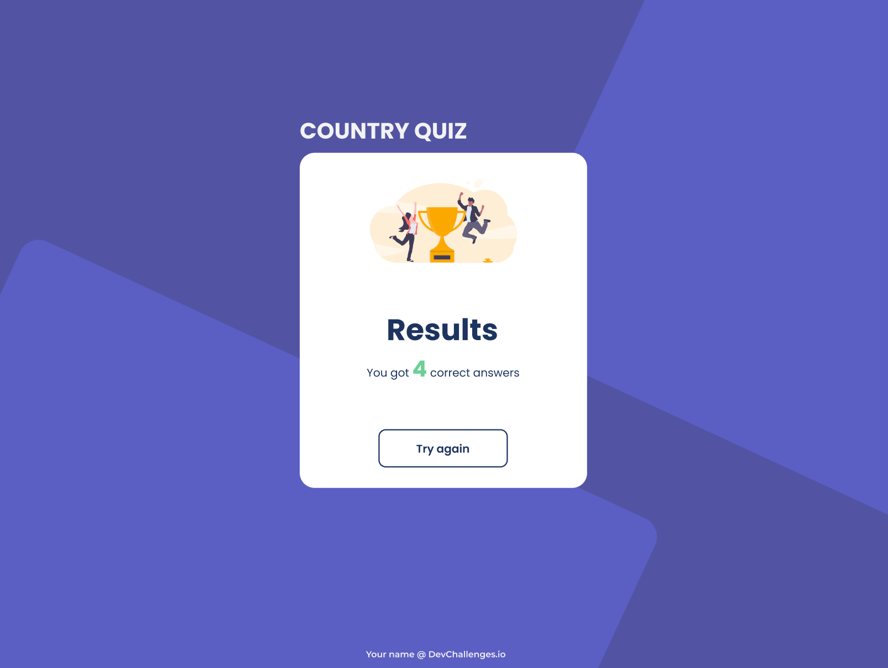
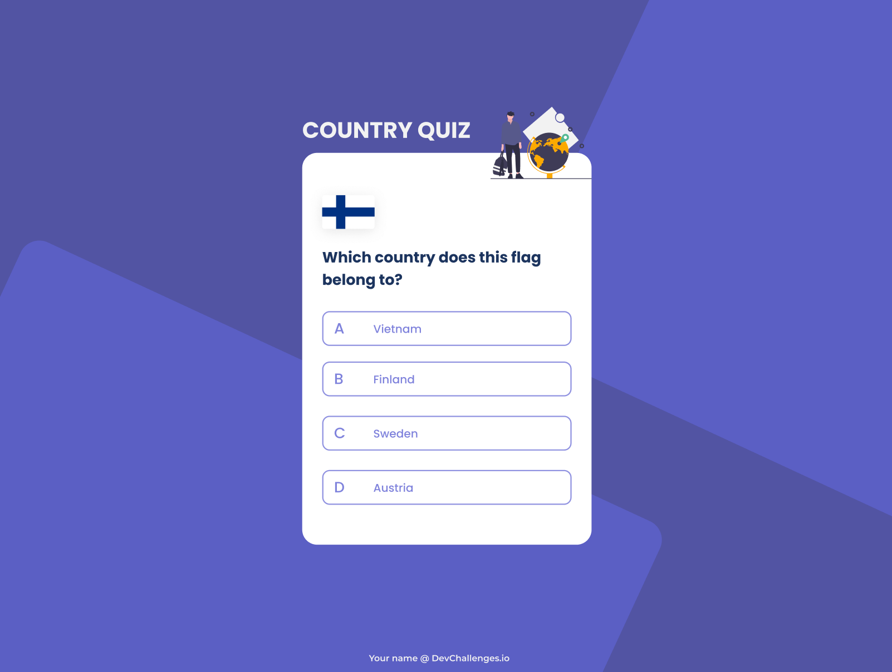

# Country Quiz

**Overview**

**Structure of the project**

- This country quiz app has two different kind of randomly questions.
- It has four random buttons so the user can choose one of them
- When user clicks on the right answer, the game is still continued. Otherewise, the page goes to a score page. Then they are able to see the score of the right answers they have gotten. If they didn't get any right answer the score will be always zero.
- The user also can try again through cliking the `Try again` button.

**How to use this app**

*CLONE THE REPOSITORY*: [GitHub](https://github.com/tsipoy/country-quiz).

*RUN THE APP*: `npm start`.

*INSTALL DEPENDENCIES*: `npm install`

*API*: https://restcountries.eu/.

*Design* : https://www.figma.com/file/Gw0ZNBbYN8asqFlZWy3jG1

*Live app* : https://country-quiz-app.netlify.app/

**Contact**

-   Website [Country Quiz](https://natacha-country-quiz.netlify.app/)
-   GitHub [tsipoy](https://github.com/tsipoy/country-quiz)

